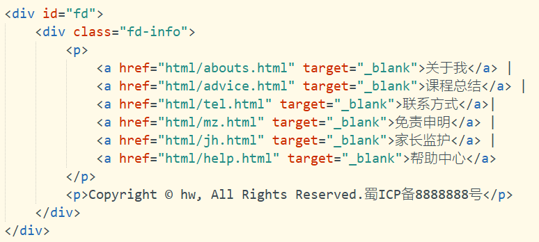

#### 简介

本网站利用现在比较流行以及比较成熟的JavaScript技术加CSS的DIV布局的架构实现的，进行系统分析，从用户的角度去思考，怎么能实现让用户既能看懂又能学会的游戏攻略，从而实现信息化，系统化和平台化，具有良好的适应性和移植性。

  此网站分为游戏内容介绍和帮助中心两个主要架构。游戏内容部分主要分为5个小部分，首页、英雄大全、英雄对比、英雄攻略、英雄排行，分别使用超链接以便用户访问相应网页；帮助中心又分为四个小块，联系方式、免责声明、家长监护、帮助中心，采用左侧导航栏的方式，使用户可以简单明了的查看信息。

 

#### 组织结构

第1章，项目的基本分析：对系统的可行性以及系统需求分析进行了研究。

第2章，介绍网站的开发平台和一些关键技术的说明。

第3章，分析了网站布局该如何选择，以及对页面的设计。

第4章，网站设计：按照软件工程的思想，从软件开发的角度，对网站的设计类图以及设计流程等进行了介绍，然后设计出系统所要实现的核心流程和核心是算法。

第5章，主要页面的实现：选取顶部导航栏，底部导航栏，及页面布局，网页之间的链接，页面风格美化等几个方面进行说明。

第6章，分析了在开发过程中遇到的重难点问题，提出了思考过程和解决方案。

第7章，网站测试：在完成测试后对展现的运行结果进行一些叙述和分析。


#### 1 系统分析

 

系统关键技术确定后，需要对项目的实际需求进行详细的需求分析，清楚地了解该项目所包含的功能，并制定完善的需求分析说明书，为后期的业务设计设定明确的目标和制定参考，严格规范的需求说明书可以避免由于既定业务需求的不确定性造成后期频繁的需求变更，在软件开发中具有举足轻重的作用。需求分析完成后进入系统架构设计系统架构设计是将软件需求转化为数据结构和软件的系统结构以及划分系统功能模块目的是将软件系统需求转换为未来系统的设计，逐步开发出健壮的系统架构，并且使设计适合于实施环境，为提高性能而进行设计。

##### 1.1系统可行性分析

1.1.1技术可行性

本系统采用Html + CSS技术来实现大部分功能，也有少部分使用到了JavaScript开发技术，以及jQuery框架。HTML称为超文本标记语言，是一种标识性的语言。它包括一系列标签．通过这些标签可以将网络上的文档格式统一，使分散的Internet资源连接为一个逻辑整体。HTML文本是由HTML命令组成的描述性文本，HTML命令可以说明文字，图形、动画、声音、表格、链接等。

一个网页对应多个HTML文件，超文本标记语言文件以.htm（磁盘操作系统DOS限制的外语缩写）为扩展名或.html（外语缩写）为扩展名。可以使用任何能够生成TXT类型源文件的文本编辑器来产生超文本标记语言文件，只用修改文件后缀即可。标准的超文本标记语言文件都具有一个基本的整体结构，标记一般都是成对出现（部分标记除外例如：<br/>），即超文本标记语言文件的开头与结尾标志和超文本标记语言的头部与实体两大部分。有三个双标记符用于页面整体结构的确认。标记符<html>，说明该文件是用超文本标记语言（本标签的中文全称）来描述的，它是文件的开头;而</html>，则表示该文件的结尾，它们是超文本标记语言文件的开始标记和结尾标记。

层叠样式表(英文全称：Cascading Style Sheets)是一种用来表现HTML（标准通用标记语言的一个应用）或XML（标准通用标记语言的一个子集）等文件样式的计算机语言。CSS不仅可以静态地修饰网页，还可以配合各种脚本语言动态地对网页各元素进行格式化。CSS 能够对网页中元素位置的排版进行像素级精确控制，支持几乎所有的字体字号样式，拥有对网页对象和模型样式编辑的能力。CSS简化了网页的格式代码，外部的样式表还会被浏览器保存在缓存里，加快了下载显示的速度，也减少了需要上传的代码数量（因为重复设置的格式将被只保存一次）。只要修改保存着网站格式的CSs样式表文件就町以改变整个站点的风格特色，在修改页面数量庞大的站点时，显得格外有用。这就避免了一个个网页的修改，大大减少了工作量。

JavaScript（简称“JS”） 是一种具有函数优先的轻量级，解释型或即时编译型的编程语言。虽然它是作为开发Web页面的脚本语言而出名的，但是它也被用到了很多非浏览器环境中，JavaScript 基于原型编程、多范式的动态脚本语言，并且支持面向对象、命令式和声明式（如函数式编程）风格。JavaScript在1995年由Netscape公司的Brendan Eich，在网景导航者浏览器上首次设计实现而成。因为Netscape与Sun合作，Netscape管理层希望它外观看起来像Java，因此取名为JavaScript。但实际上它的语法风格与Self及Scheme较为接近。JavaScript的标准是ECMAScript 。截至 2012 年，所有浏览器都完整的支持ECMAScript 5.1，旧版本的浏览器至少支持ECMAScript 3 标准。2015年6月17日，ECMA国际组织发布了ECMAScript 的第六版，该版本正式名称为 ECMAScript 2015，但通常被称为ECMAScript 6 或者ES6。

jQuery是一个快速、简洁的JavaScript框架，是继Prototype之后又一个优秀的JavaScript代码库（或JavaScript框架）。jQuery设计的宗旨是“write Less，Do More”，即倡导写更少的代码，做更多的事情。它封装JavaScript常用的功能代码，提供一种简便的JavaScript设计模式，优化HTML文档操作、事件处理、动画设计和Ajax交互。jQuery的核心特性可以总结为：具有独特的链式语法和短小清晰的多功能接口；具有高效灵活的css选择器，并且可对CSS选择器进行扩展；拥有便捷的插件扩展机制和丰富的插件。jQuery兼容各种主流浏览器，如IE 6.0+、FF 1.5+、Safari 2.0+、Opera 9.0+等。

 

1.1.2经济可行性

本项目是基于html开发，开发平台我们选择Visual Studio Code，此版本为免费版，由Microsoft公司免费提供给开发者使用；主流的开发环境有Windows和Linux，我们选择使用Windows进行开发，因为Windows我们比较熟悉，方便我们快速入手项目开发，所以需要一台安装了Windows操作系统的计算机；此外还使用了jQuery框架，这个框架也是免费提供给开发者使用和学习的。因此，总的经济方面付出不高，故经济可行性较高。

 

1.1.3操作可行性

目前，大多数计算机都能运行该系统，该系统的安装、调试、运行不会改变原计算机系统的设置和布局，并且系统界面简单，提示信息完整，即使无相关人员指导也能够方便的操作此网站。

 

##### 1.2 模块概述

根据上面的分析，需要设计出网站的主页和其他页面。用户在访问主页的时候也可以通过超链接访问其他网页，并且可以随时返回主页。通过研究分析，主页包含的模块大致有以下几个：

（1）顶部导航栏：导航栏位置、导航栏宽带和高度、导航栏背景颜色、导航栏布局、导航栏内容、鼠标移入的动态效果。

（2）底部导航栏：导航栏位置、导航栏宽带和高度、导航栏背景颜色、导航栏布局、导航栏链接、导航栏界面美化、版权信息声明。

（3）中间内容：背景图片、布局方式、内容宽度、内容排版、内容缩进、合理的放置文字和图片、更多内容提示链接。

其他页面的功能如下：

关于我页面：这个页面使用div技术进行布局，包含顶部区块，顶部导航栏，左侧自我介绍区块，右侧详细介绍区块，顶部区块包含了自己的简介，顶部导航栏包括了相册、课程总结及主页的超链接，左侧自我介绍区块包括了自我介绍说明和图片一张，右侧区块则包括了图片及详细的文字说明。

帮助中心页面：帮助中心页面采用了左侧主导航栏的方式进行设计，这样可以使用户简单清楚的浏览网页信息，及快速跳转至联系方式、免责声明和家长监护页面，除此之外还设计了顶部导航栏及底部链接栏，可以跳转至其他任意页面。  

设计完成后的网站具有：建成后的系统是一个综合性游戏攻略网站，有着统一友好的操作界面，保证系统的易用性，基本完成了用户对网站的要求。

 

##### 1.3 本章小结

本章从系统的可行性方面及模块方面分析了系统的需求。


#### 2开发平台及技术基础

##### 2.1 开发平台

Microsoft Visual Studio是VS的全称。VS是美国微软公司的开发工具包系列产品。VS是一个基本完整的开发工具集，它包括了整个软件生命周期中所需要的大部分工具，如UML工具、代码管控工具、集成开发环境(IDE)等等。所写的目标代码适用于微软支持的所有平台，包括Microsoft Windows、Windows Mobile、Windows CE、.NET Framework、.Net Core、.NET Compact Framework和Microsoft Silverlight 及Windows Phone。Visual Studio是目前最流行的Windows平台应用程序的集成开发环境。最新版本为 Visual Studio 2019版本，基于.NET Framework 4.7。该编辑器也集成了所有一款现代编辑器所应该具备的特性，包括语法高亮（syntax high lighting），可定制的热键绑定（customizable keyboard bindings），括号匹配（bracket matching）以及代码片段收集（snippets）。Somasegar 也告诉笔者这款编辑器也拥有对 Git 的开箱即用的支持。

Visual Studio Code 提供了丰富的快捷键。用户可通过快捷键 [Ctrl] + [K] + [S] （按住Ctrl键不放，再按字母K键和S键）调出快捷键面板，查看全部的快捷键定义。也可在面板中双击任一快捷键，为某项功能指定新的快捷键。一些预定义的常用快捷键包括：格式化文档（整理当前视图中的全部代码），[Shift] + [Alt] + [F]；格式化选定内容（整理当前视图中被选定部分代码），[Ctrl] + [K] + [F]；放大视图，[Ctrl] + [Shift] + [=]；缩小视图，[Ctrl] + [Shift] + [-]；打开新的外部终端（打开新的命令行提示符）：[Ctrl] + [Shift] + [C]。

 

2.1.1 HTML

HTML的英文全称是 Hypertext Marked Language，即超文本标记语言。HTML是由Web的发明者 Tim Berners-Lee和同事 Daniel W. Connolly于1990年创立的一种标记语言，它是标准通用化标记语言SGML的应用。用HTML编写的超文本文档称为HTML文档，它能独立于各种操作系统平台(如UNIX， Windows等)。使用HTML语言，将所需要表达的信息按某种规则写成HTML文件，通过专用的浏览器来识别，并将这些HTML文件“翻译”成可以识别的信息，即现在所见到的网页。 [2] 

自1990年以来，HTML就一直被用作WWW的信息表示语言，使用HTML语言描述的文件需要通过WWW浏览器显示出效果。HTML是一种建立网页文件的语言，通过标记式的指令(Tag)，将影像、声音、图片、文字动画、影视等内容显示出来。事实上，每一个HTML文档都是一种静态的网页文件，这个文件里面包含了HTML指令代码，这些指令代码并不是一种程序语言，只是一种排版网页中资料显示位置的标记结构语言，易学易懂，非常简单。HTML的普遍应用就是带来了超文本的技术―通过单击鼠标从一个主题跳转到另一个主题，从一个页面跳转到另一个页面，与世界各地主机的文件链接超文本传输协议规定了浏览器在运行HTML文档时所遵循的规则和进行的操作。HTTP协议的制定使浏览器在运行超文本时有了统一的规则和标准。

 

2.1.2 CSS

CSS是一种定义样式结构如字体、颜色、位置等的语言，被用于描述网页上的信息格式化和现实的方式。CSS样式可以直接存储于HTML网页或者单独的样式单文件。无论哪一种方式，样式单包含将样式应用到指定类型的元素的规则。外部使用时，样式单规则被放置在一个带有文件扩展名_css的外部样式单文档中。

样式规则是可应用于网页中元素，如文本段落或链接的格式化指令。样式规则由一个或多个样式属性及其值组成。内部样式单直接放在网页中，外部样式单保存在独立的文档中，网页通过一个特殊标签链接外部样式单。

名称CSS中的“层叠（cascading）”表示样式单规则应用于HTML文档元素的方式。具体地说，CSS样式单中的样式形成一个层次结构，更具体的样式覆盖通用样式。样式规则的优先级由CSS根据这个层次结构决定，从而实现级联效果。

CSS为HTML标记语言提供了一种样式描述，定义了其中元素的显示方式。CSS在Web设计领域是一个突破。利用它可以实现修改一个小的样式更新与之相关的所有页面元素。

总体来说，CSS具有以下特点：

（1）丰富的样式定义

CSS提供了丰富的文档样式外观，以及设置文本和背景属性的能力；允许为任何元素创建边框，以及元素边框与其他元素间的距离，以及元素边框与元素内容间的距离；允许随意改变文本的大小写方式、修饰方式以及其他页面效果。

（2）易于使用和修改

CSS可以将样式定义在HTML元素的style属性中，也可以将其定义在HTML文档的header部分，也可以将样式声明在一个专门的CSS文件中，以供HTML页面引用。总之，CSS样式表可以将所有的样式声明统一存放，进行统一管理。

另外，可以将相同样式的元素进行归类，使用同一个样式进行定义，也可以将某个样式应用到所有同名的HTML标签中，也可以将一个CSS样式指定到某个页面元素中。如果要修改样式，我们只需要在样式列表中找到相应的样式声明进行修改。

（3）多页面应用

CSS样式表可以单独存放在一个CSS文件中，这样我们就可以在多个页面中使用同一个CSS样式表。CSS样式表理论上不属于任何页面文件，在任何页面文件中都可以将其引用。这样就可以实现多个页面风格的统一。

（4）层叠

简单的说，层叠就是对一个元素多次设置同一个样式，这将使用最后一次设置的属性值。例如对一个站点中的多个页面使用了同一套CSS样式表，而某些页面中的某些元素想使用其他样式，就可以针对这些样式单独定义一个样式表应用到页面中。这些后来定义的样式将对前面的样式设置进行重写，在浏览器中看到的将是最后面设置的样式效果。

（5）页面压缩

在使用HTML定义页面效果的网站中，往往需要大量或重复的表格和font元素形成各种规格的文字样式，这样做的后果就是会产生大量的HTML标签，从而使页面文件的大小增加。而将样式的声明单独放到CSS样式表中，可以大大的减小页面的体积，这样在加载页面时使用的时间也会大大的减少。另外，CSS样式表的复用更大程度的缩减了页面的体积，减少下载的时间。

 

2.1.3 JavaScript

JavaScript（简称“JS”） 是一种具有函数优先的轻量级，解释型或即时编译型的编程语言。虽然它是作为开发Web页面的脚本语言而出名的，但是它也被用到了很多非浏览器环境中，JavaScript 基于原型编程、多范式的动态脚本语言，并且支持面向对象、命令式和声明式（如函数式编程）风格。

JavaScript是一种属于网络的脚本语言,已经被广泛用于Web应用开发,常用来为网页添加各式各样的动态功能,为用户提供更流畅美观的浏览效果。通常JavaScript脚本是通过嵌入在HTML中来实现自身的功能的。

（1）是一种解释性脚本语言（代码不进行预编译）。

（2）主要用来向HTML（标准通用标记语言下的一个应用）页面添加交互行为。

（3）可以直接嵌入HTML页面，但写成单独的js文件有利于结构和行为的分离。

（4）跨平台特性，在绝大多数浏览器的支持下，可以在多种平台下运行（如Windows、Linux、Mac、Android、iOS等）。

Javascript脚本语言同其他语言一样，有它自身的基本数据类型，表达式和算术运算符及程序的基本程序框架。Javascript提供了四种基本的数据类型和两种特殊数据类型用来处理数据和文字。而变量提供存放信息的地方，表达式则可以完成较复杂的信息处理。

 

##### 2.2 技术基础

2.2.1 jQuery 框架

jQuery的模块可以分为3部分：入口模块、底层支持模块和功能模块。

在构造jQuery对象模块中，如果在调用构造函数jQuery()创建jQuery对象时传入了选择器表达式，则会调用选择器Sizzle（一款纯JavaScript实现的CSS选择器引擎，用于查找与选择器表达式匹配的元素集合）遍历文档，查找与之匹配的DOM元素，并创建一个包含了这些DOM元素引用的jQuery对象。

浏览器功能测试模块提供了针对不同浏览器功能和bug的测试结果，其他模块则基于这些测试结果来解决浏览器之间的兼容性问题。

在底层支持模块中，回调函数列表模块用于增强对回调函数的管理，支持添加、移除、触发、锁定、禁用回调函数等功能；异步队列模块用于解耦异步任务和回调函数，它在回调函数列表的基础上为回调函数增加了状态，并提供了多个回调函数列表，支持传播任意同步或异步回调函数的成功或失败状态；数据缓存模块用于为DOM元素和Javascript对象附加任意类型的数据；队列模块用于管理一组函数，支持函数的入队和出队操作，并确保函数按顺序执行，它基于数据缓存模块实现。

在功能模块中，事件系统提供了统一的事件绑定、响应、手动触发和移除机制，它并没有将事件直接绑定到DOM元素上，而是基于数据缓存模块来管理事件；Ajax模块允许从服务器上加载数据，而不用刷新页面，它基于异步队列模块来管理和触发回调函数；动画模块用于向网页中添加动画效果，它基于队列模块来管理和执行动画函数；属性操作模块用于对HTML属性和DOM属性进行读取、设置和移除操作；DOM遍历模块用于在DoM树中遍历父元素、子元素和兄弟元素；DOM操作模块用于插入、移除、复制和替换DOM元素；样式操作模块用于获取计算样式或设置内联样式；坐标模块用于读取或设置DOM元素的文档坐标；尺寸模块用于获取DOM元素的高度和宽度。

 

2.2.2 Div 布局

DIV是层叠样式表中的定位技术，全称DIVision，即为划分。有时可以称其为图层。 DIV元素是用来为HTML（标准通用标记语言下的一个应用）文档内大块（block-level）的内容提供结构和背景的元素。

<div> 可定义文档中的分区或节（division/section）。

<div> 标签可以把文档分割为独立的、不同的部分。它可以用作严格的组织工具，并且不使用任何格式与其关联。

如果用 id 或 class 来标记 <div>，那么该标签的作用会变得更加有效。

注释：<div> 是一个块级元素，也就是说，浏览器通常会在 div 元素前后放置一个换行符。

提示：请使用 <div> 元素来组合块级元素，这样就可以使用样式对它们进行格式化。

 

##### 2.3 本章小结

本章主要介绍了系统的开发平台和相关基础技术，从技术层面来说明开发本系统的可行性是成立的。


#### 3 页面设计

##### 3.1 页面布局介绍

在进行网站制作前，首先要进行网站页面的整体设计。一个网站是由若干个网页构成的，网页是用户访问网站的界面。因此，通常意义上的网站设计，即指的是网站中各个页面的设计。而网页设计中，最先提到的就是网页的布局。布局是否合理、美观，将直接影响到用户的阅读体验及访问时间。

在互联网高速发展的今天，网络已成为人们生活的一部分，成为人们获取信息资源的重要途径。信息的呈现离不开网页这个重要的界面，网页的主要作用是将用户需要的信息与资源采用一定的手段进行组织，通过网络呈现给用户。

随着网络技术及其带宽的提高，网页的组成元素也发生了很大的变化。在90年代末，网页的构成元素主要就是大量的文本、表格、超链接和极少数量的静态图像和gif动图。现在的网页除了以上的组成元素外又增加了大量的图像、动画、视频、音乐、横幅广告以及多种动态效果。

 

##### 3.2 主要页面设计

3.2.1 主页设计

如图3-1所示，主页包括底部导航栏，背景图片，中间热门英雄列表及其超链接，底部导航栏，底部版权信息。

<center>图3-1 主页</center>

 

3.2.2 自我介绍页设计

如图3-2所示，自我介绍页包括顶部自我简介，及顶部导航栏，左侧头像及详细信息介绍，右侧则为更加详细的介绍说明。


<center>图3-2 自我介绍页</center>

 

3.2.3 课程总结页面设计

如图3-3所示，课程总结页包括项目所用开发技术的总结和对本门课程的总结及建议。项目总结部分可使用<ul>标签实现列表的显示功能，课程总结部分则可以使用<h1>、<p>等标签对文字进行排版，以答最佳显示效果。


<center>图3-3 课程总结页</center>

 

##### 3.3 帮助中心页面设计

如图3-4所示，帮助中心页包括顶部导航栏，左侧导航栏，及右侧文字说明。重点也是难点的部分是左侧的导航栏，较难实现。


<center>图3-4 帮助中心页</center>

 

##### 3.4 本章小结

 本章介绍了从怎么样选择合适的布局方式设计页面，建立主页以及页面与页面之间的链接关系。

 

#### 4 网站设计

##### 4.1网站整体架构设计

整个网站主要通过顶部导航栏的超链接来实现各页面之间的互联互通，除此之外还可以通过底部导航栏访问自我介绍页面及课程总结页面，以及帮助中心、联系方式等多个页面，以次来达到各网页间相互链接的目的。

层次这件的依赖关系的原则应该是自顶向下的，即上层可以依赖下层，而下层应该尽量减少对上层的依赖，同时层次间的交互应该通过接口进行交互。

 

  <center>图4-1顶部导航栏</center>

 

##### 4.2系统功能模块设计

根据系统功能分析，可以画出系统的功能模块图。如图4-2所示


<center>图4-2功结构图</center>


从图中可以看出，主页大致分为四个模块，顶部导航栏，中间部分模块，下部分更多内容模块，底部导航栏模块。


##### 4.3本章小结

本章主要从功能模块以及页面链接设计两部分，进行了系统设计分析。


#### 5 主要页面实现

##### 5.1 系统主要页面的实现

5.1.1 主页的实现

主页的主体部分采用Div+表格的布局方式，如图5-1 。


<center>图5-1主页布局源代码图</center>

Div技术为主体布局，并在其中使用了表格进行排版。

Div：CSS的一个比较重要的用途：布局。以前我们学过表格可以起到布局页面的作用，比如布局表单，但实际工作表格的布局通常也仅仅是用来布局表单。绝大多数的模具工作是由CSS+DIV来完成的，因为表格布局 复杂页面时需要频繁的嵌套，代码比较复杂、难以维护，而使用CSS+DIV布局，内容和表现可以分离，代码干净整洁、可读性好、便于维护，并且样式代码可以复用，提高了开发效率，同时分离后美工和网站开发人员也可以协同合作，进一步提高了开发效率和整体网站的质量。

表格布局：过去的前端工作者曾利用<table>以实现“表格布局”。因为表格中同一行的单元格行高总是一致的，所以“表格布局”可以避免“浮动布局”时出现的“底部对不齐”情况。

二者整合使得网页的耦合降低了，每个模块都是分开布局的，所有当某一个模块需要修改，对其他模块几乎没有影响，每个模块的修改不太影响其他，大大增强了系统性能。

 

5.1.2帮助中心页面的实现

帮助中心页面主要通过左侧导航栏来实现联系方式、免责声明、家长监护及帮助中心四个页面的相互访问，左侧导航栏主要使用Div布局，并使用<ul>、<ol>、<li>标签进行排版设计，用CSS技术进行美化，以达到使用户访问更方便。视觉效果更友好的效果。

 

<center>图5-2帮助中心源代码图</center>

 

5.2 系统功能模块的设计与实现

5.2.1 顶部导航栏的实现

所谓的网站的导航结构指的是引导用户访问网站的栏目、菜单、在线帮助、分类等布局结构等形式的总称。所以网站建设的过程中一定要使网站导航结构清晰，能够使访问者在最短时间内找到自己喜欢的内容。对于导航的布局搜索引擎和用户都有利，便于提升网站内的用户操作和浏览，也便于搜索引擎目录索引和识别。

通常来说主导航目录均为网站的一级目录，所以为了让网站扁平化，搜索引擎蜘蛛不用过深层次的抓取，利用好主导航的目录层次优势规划内容非常有必要。

大多数导航栏都是位于网页中上方，右上角，左上角三个位置，那么为什么要这样布局呢？很简答，因为这三个位置用户体验更好，当用户进入一个网站以后，第一眼看到的就是这三个位置，就好比我们看一个人一样，第一眼肯定是看它的眼睛，道理是一样的。如图5-3。


<center>图5-3-1顶部导航栏html代码</center>


<center>图5-3-2顶部导航栏css代码</center>

 

5.2.2 底部导航栏的实现

底部导航栏也同样采用了Div的布局方式，Div+css布局的好处：

（1）符合W3C标准，代码结构清晰明了，结构、样式和行为分离，带来足够好的可维护性。

（2）布局精准，网站版面布局修改简单。

（3）加快了页面的加载速度（最重要的）。

（4）节约站点所占的空间和站点的流量。

（5）用只包含结构化内容的HTML代替嵌套的标签，提高另外搜索引擎对网页的搜索效率。



<center>图5-4 底部导航栏html代码</center>


 

##### 5.3本章小结

本章主要介绍了本系统主页、帮助中心的实现以及系统功能模块的实现两部分，系统架构的实现主要从页面布局设计，页面排版美化实现两方面进行介绍，系统功能模块介绍了顶部导航栏和底部导航栏的布局方式，以及如何实现。


#### 6 重难点分析及解决方案

##### 6.1 顶部导航栏模块重难点

 当用户鼠标移入的时候，颜色发生变化，增强用户的使用体验，同时达到导航栏导航的目的，及导航栏在页面中的位置，导航栏的大小，等等。

当点击的首页中导航栏“首页“时，颜色将发生变化，当用户鼠标移入所需填注册信息框时，将会触发mouseover事件，对背景颜色及字体颜色进行更改，页面效果如图6-1。


<center>图6-1 顶部导航栏</center>

导航栏的大小应该宽度为1024，并且要在页面的最顶部。其实现的部分核心代码如下：

 

```css
/* 导航 */
			.navbar {
				overflow: hidden;
				background-color: #333;
				margin: 0 auto;
				text-align: center;
			}
/* 导航栏样式 */
			.navbar a {
				float: left;
				display: block;
				color: white;
				text-align: center;
				padding: 14px 20px;
				text-decoration: none;
			}
/* 右侧链接*/
			.navbar a.right {
				float: right;
			}
/* 鼠标移动到链接的颜色 */
			.navbar a:hover {
				background-color: #ddd;
				color: black;
			}

	<div class="navbar" style="width: 1024px;">
			<a href="index.html">首页</a>
			<a href="html/hero1.html">英雄大全</a>
			<a href="html/hero2.html">英雄排行</a>
			<a href="html/hero3.html">英雄对比</a>
			<a href="html/hero4.html">英雄攻略</a>
			<a href="html/money.html" class="right">打赏站主</a>
		</div>

```

 

从代码中可以看出来css通过其class拿到页面上对应的字段进行不同判断，如对你邮件格式的判断是采用正则表达式验证其是否合法，只有当所有验证通过时，方法才能执行下一步。

当用户点击相应链接，系统经过判定，跳到相应页面，如图6-2


<center>图6-2 英雄大全页面</center>

 

##### 6.2 底部导航栏模块重难点

 在上一章“主页导航栏模块的实现”一节中谈到，在主页页面可通过顶部导航栏访问多个网页，并能随时回到首页，如何实现这一功能，以及超链接应该放在什么位置，这些都是不容忽视的问题。

首先底部导航栏与顶部导航栏有很大的不同，顶部导航栏只需要将不同页面的超链接放入在相应的区块内即可，底部导航栏则有所不同，除了需要将不同链接放入之外，还需要显示版权信息。如图6-3


<center>图6-3 底部导航栏</center>

页面主要是css代码，如下：

```css
#fd {
				background-color: #494949;
				padding-top: 20px;
				height: 85px;
				color: #999999;
				width: 1024px;
				margin: 0 auto;
			}

			.fd-info {
				overflow: hidden;
				width: 1024px;
				text-align: center;
				line-height: 28px;
				font-size: 14px;
			}

			.fd-info a {
				color: #999;
				margin: 0 8px;
			}

			.fd-info a:hover {
				color: black;
				text-decoration: underline;
			}

<div id="fd">
			<div class="fd-info">
				<p>
					<a href="html/abouts.html" target="_blank">关于我</a> |
					<a href="html/advice.html" target="_blank">课程总结</a> |
					<a href="html/tel.html" target="_blank">联系方式</a>|
					<a href="html/mz.html" target="_blank">免责申明</a> |
					<a href="html/jh.html" target="_blank">家长监护</a> |
					<a href="html/help.html" target="_blank">帮助中心</a>
				</p>
				<p>Copyright © hw, All Rights Reserved.蜀ICP备8888888号</p>
			</div>
</div>
```

 

如上述代码所示，首先在前台通过jQuery class选择器拿到加减事件，通过Ajax异步请求将修改数量的请求发送到后台方法，后台使用JSON格式的对象返回给前台页面，Ajax再对其进行解析，最终实现数量的增加或者减少。

##### 6.3 页面布局重难点

(1)浏览器兼容性 。DIV+CSS更容易出现多种浏览器不兼容的问题，主要原因是不同的浏览器对web标准默认值不同。

(2)网页不喜欢一个页面有太多的css代码，否则同样会影响蜘蛛的爬行，影响搜索引擎的收录，所以采用外部调用的方式调用CSS是非常不错的方法。

 

##### 6.4本章小结

本章就详细设计一章中的模块里重难点进行了单独讨论，更加细致，清楚的展现实现原理和过程。

 

#### 7系统测试

##### 7.1 系统测试的目的 

系统测试，英文是System Testing。是对整个系统的测试，将硬件、软件、操作人员看作一个整体，检验它是否有不符合系统说明书的地方。这种测试可以发现系统分析和设计中的错误。如安全测试是测试安全措施是否完善，能不能保证系统不受非法侵入。再例如，压力测试是测试系统在正常数据量以及超负荷量(如多个用户同时存取) 等情况下是否还能正常地工作。

系统测试是将经过集成测试的软件，作为计算机系统的一个部分，与系统中其他部分结合起来，在实际运行环境下对计算机系统进行的一系列严格有效地测试，以发现软件潜在的问题，保证系统的正常运行。主要内容包括：

（1）功能测试。即测试软件系统的功能是否正确，其依据是需求文档，如《产品需求规格说明书》。由于正确性是软件最重要的质量因素，所以功能测试必不可少。

（2）健壮性测试。即测试软件系统在异常情况下能否正常运行的能力。健壮性有两层含义：一是容错能力，二是恢复能力

 

##### 7.2 系统测试的方法

软件测试的方法和技术是多种多样的。对于软件测试技术，可以从不同的角度加以分类:从是否需要执行被测软件的角度，可分为静态测试和动态测试。从测试是否针对系统的内部结构和具体实现算法的角度来看，可分为白盒测试和黑盒测试。

（1）黑盒测试

黑盒测试也称功能测试，它是通过测试来检测每个功能是否都能正常使用。在测试中，把程序看作一个不能打开的黑盒子，在完全不考虑程序内部结构和内部特性的情况下，在程序接口进行测试，它只检查程序功能是否按照需求规格说明书的规定正常使用，程序是否能适当地接收输入数据而产生正确的输出信息。黑盒测试着眼于程序外部结构，不考虑内部逻辑结构，主要针对软件界面和软件功能进行测试。

黑盒测试是以用户的角度，从输入数据与输出数据的对应关系出发进行测试的。很明显，如果外部特性本身设计有问题或规格说明的规定有误，用黑盒测试方法是发现不了的。

（2）白盒测试

白盒测试又称结构测试、透明盒测试、逻辑驱动测试或基于代码的测试。白盒测试是一种测试用例设计方法，盒子指的是被测试的软件，白盒指的是盒子是可视的，即清楚盒子内部的东西以及里面是如何运作的。"白盒"法全面了解程序内部逻辑结构、对所有逻辑路径进行测试。"白盒"法是穷举路径测试。在使用这一方案时，测试者必须检查程序的内部结构，从检查程序的逻辑着手，得出测试数据。贯穿程序的独立路径数是天文数字。

##### 7.4本章小结

本章主要是测试了系统功能的正确性，由于系统模块较多，所以这里是以导航栏模块为例进行测试。


#### 8.系统不足与展望

由于时间不是很足，在网站运行效率和服务器容量方面并未加以考虑，在实际的游戏攻略网站中，数据量是较为庞大的，所以这就十分考验系统程序的效率和健壮性了，服务器选用也是需要慎重的，不然很可能造成崩溃，给用户十分差的体验。随着Web应用的快速发展，会有更多更好的框架技术涌现出来，不光要对框架深入学习和熟练应用，还要对系统设计模式和设计策略进行研究，从高层次设计出优秀的软件系统。后期准备在本系统的基础上，增添一个新的模块——游戏直播体验版。以上的只是目前的构思，后面会深入研究。


#### 结 论

本次Web期末设计论述了王者荣耀游戏攻略网站系统的主要功能及体系结构,重点讨论了开发技术以及系统的各项功能模块、各模块的系统流程，及模块功能的实现,每个模块在都能完成其功能的结果下将其综合成一个完整的系统。目前基于该模型的系统处于实验室阶段,还存在许多问题与不足,如安全性能还不完善,缺少用户登录功能等，这些功能与技术还需要加以提高和实现。在具体实施的过程中，在程序的调试上出现了不少的问题，要使用浏览器来浏览才能找出错误所在，这一定程度上延长了调试时间。在开始的时候往往要为了找一个小错误花上大半天的时间。经过多写程序，现在一定程度上已经能快速的找出错误，并能熟练的修改。游戏网站最大的功能就是让用户在第一时间能得到游戏内容的具体变化，以及应对方式，如何在第一时间将网站内容更新，这是这个巨大的问题，而且就现阶段而言难以解决的问题，相信在未来对web前端开发技术的进一步学习，总有一日会解决这些问题，给用户一个更加完整的体验。


 

#### 参考文献


[1]  孙素华编著．Dreamweaver CS5 Flash CS5 Photoshop CS5网页设计从入门到精通：中国青年出版社，2014.10

[2]  张季谦，仲志平，王再见编著．网页设计与制作 第2版：中国科学技术大学出版社，2017.01

[3]  武仁杰主编；王志辉，米海英，郭晓玲副主编；郭喜凤主审．WEB 程序设计：中国铁道出版社，2015.08

[4]  云海科技编著．网页设计艺术：北京希望出版社，2015.01

[5]  秦学礼，邓松如．Web网站设计教程[M]．北京：电子工业出版社.2004.

[6]  鄢涛，刘永红，于曦. Web前端开发技术（慕课版）.科学出版社.2018.01